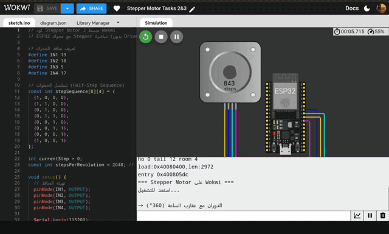
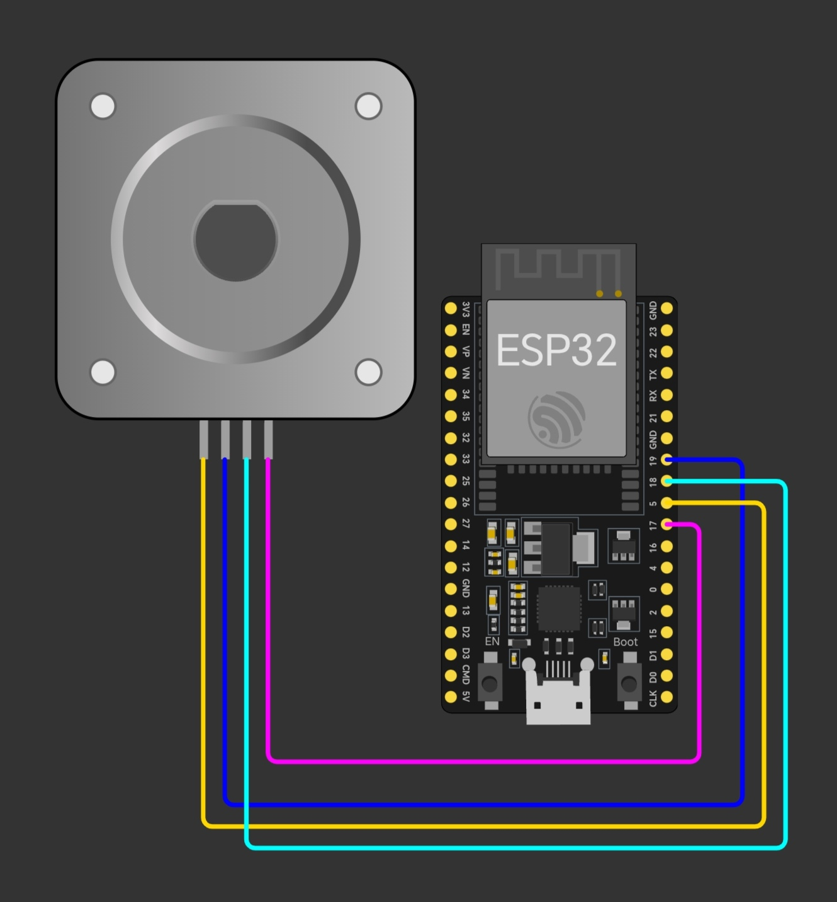

# 🔄 Stepper Motor Control with ESP32


**التحكم في محرك خطوي (Stepper Motor) باستخدام ESP32**

<div dir="rtl" align="right">
  
[🔗 Live Demo](https://wokwi.com/projects/446461241693771777) 





---

## 📖 نظرة عامة

هذا المشروع يوضح كيفية التحكم في محرك خطوي (Stepper Motor) من نوع **28BYJ-48** باستخدام متحكم **ESP32** في بيئة المحاكاة **Wokwi**. يتضمن المشروع برمجة حركة المحرك في اتجاهين مختلفين والتحكم الديناميكي في سرعته.

---

## 🎯 الهدف من المشروع

### الأهداف التعليمية:
1. **فهم آلية عمل المحركات الخطوية** (Stepper Motors)
2. **التحكم في الاتجاه** (Clockwise & Counter-Clockwise)
3. **التحكم في السرعة** (Speed Control & Acceleration)
4. **برمجة ESP32** باستخدام Arduino Framework
5. **استخدام بيئة محاكاة Wokwi** للنماذج الأولية

### الأهداف العملية:
- تنفيذ دورات كاملة في اتجاهين متعاكسين
- تطبيق التسارع والتباطؤ التدريجي
- التحكم الدقيق في خطوات المحرك (Step Control)

---

## 🛠️ المكونات المستخدمة

| المكون | الوصف | الكمية |
|--------|-------|--------|
| **ESP32 DevKit** | متحكم دقيق بمعالج Xtensa 32-bit | 1 |
| **28BYJ-48 Stepper Motor** | محرك خطوي أحادي القطب (Unipolar) | 1 |
| **ULN2003 Driver** | دارة تشغيل المحرك (مدمجة في Wokwi) | 1 |
| **أسلاك توصيل** | لربط المكونات | 6 |

### مواصفات المحرك:
- **النوع:** 28BYJ-48 (5V Unipolar Stepper)
- **الخطوات:** 2048 خطوة/دورة (مع التروس)
- **الزاوية:** ~0.176° لكل خطوة
- **الجهد:** 5V DC
- **التيار:** ~240mA

---

## 🔌 مخطط التوصيل

### جدول التوصيلات:

```
ESP32 Pin  →  Stepper Motor (ULN2003)
──────────────────────────────────────
GPIO 19    →  IN1
GPIO 18    →  IN2
GPIO 5     →  IN3
GPIO 17    →  IN4
```

### مخطط بصري:



---

## 📝 المهام المنفذة

### 🔹 Task 1: Bidirectional Rotation
**الوصف:** دوران المحرك دورة كاملة في كلا الاتجاهين

**الخطوات:**
1. دوران 360° مع عقارب الساعة (Clockwise)
2. توقف لمدة ثانية واحدة
3. دوران 360° عكس عقارب الساعة (Counter-Clockwise)

**الكود المستخدم:**
```cpp
rotateDegrees(360, 2, true);   // CW
delay(1000);
rotateDegrees(360, 2, false);  // CCW
```

---

### 🔹 Task 2: Speed Control (Acceleration & Deceleration)
**الوصف:** التحكم الديناميكي في سرعة المحرك

**الخطوات:**
1. **التسارع التدريجي:** البدء بطيئاً وزيادة السرعة حتى الوصول للسرعة القصوى
2. **السرعة القصوى:** التشغيل بأقصى سرعة لمدة ثانيتين
3. **التوقف:** إيقاف المحرك لمدة ثانيتين
4. **التباطؤ التدريجي:** إعادة التشغيل وتقليل السرعة تدريجياً حتى التوقف الكامل

**منحنى السرعة:**
```
السرعة
  ↑
  │         ┌────┐  أقصى سرعة
  │        ╱      ╲
  │       ╱        ╲
  │      ╱          ╲
  │     ╱            ╲
  │    ╱              ╲
  └───┴────────────────┴───→ الزمن
   تسارع    توقف    تباطؤ
```

---

## 💻 شرح الكود

### 🔧 الدوال الرئيسية:

#### 1. `rotateDegrees(degrees, speed, clockwise)`
تدوير المحرك بزاوية محددة.

**المعاملات:**
- `degrees`: الزاوية بالدرجات (0-360)
- `speed`: سرعة الدوران (تأخير بالميلي ثانية)
- `clockwise`: الاتجاه (true = CW, false = CCW)

#### 2. `stepMotor(clockwise, delayTime)`
تنفيذ خطوة واحدة للمحرك.

**الآلية:**
- استخدام Half-Step Sequence (8 خطوات)
- التحكم في اتجاه العد (تصاعدي/تنازلي)
- تطبيق التسلسل على منافذ GPIO

#### 3. `stopMotor()`
إيقاف المحرك بإطفاء جميع الملفات.

---

### 🧮 المفاهيم البرمجية:

**Step Sequence (تسلسل الخطوات):**
```cpp
const int stepSequence[8][4] = {
  {1, 0, 0, 0},  // Step 0
  {1, 1, 0, 0},  // Step 1
  {0, 1, 0, 0},  // Step 2
  {0, 1, 1, 0},  // Step 3
  {0, 0, 1, 0},  // Step 4
  {0, 0, 1, 1},  // Step 5
  {0, 0, 0, 1},  // Step 6
  {1, 0, 0, 1}   // Step 7
};
```

**حساب عدد الخطوات:**
```cpp
long steps = (long)degrees * stepsPerRevolution / 360;
// مثال: 360° = 2048 خطوة (دورة كاملة)
```

---

## 🚀 كيفية التشغيل

### على Wokwi (المحاكاة):
1. افتح الرابط: [wokwi.com/projects/446461241693771777](https://wokwi.com/projects/446461241693771777)
2. اضغط على زر **▶ Start Simulation**
3. راقب حركة المحرك والرسائل في Serial Monitor

### على Hardware الفعلي:
1. قم بتوصيل المكونات حسب المخطط أعلاه
2. افتح Arduino IDE وثبت مكتبة ESP32
3. ارفع الكود `sketch.ino` للوحة ESP32
4. افتح Serial Monitor (115200 baud)
5. راقب التنفيذ

---

## 🎬 Demo

### فيديو توضيحي:


### Serial Monitor Output:
```
=== Stepper Motor على Wokwi ===
استعد للتشغيل...

→ الدوران مع عقارب الساعة (360°)
← الدوران عكس عقارب الساعة (360°)
✓ Task 1 مكتمل!

⚡ Task 2: بدء التسارع...
السرعة: 1
السرعة: 2
...
السرعة: 10
🚀 أقصى سرعة لمدة ثانيتين...
⏸️  توقف لمدة ثانيتين
🐌 التباطؤ التدريجي...
✓ Task 2 مكتمل!
```

---

## 🧪 التحديات والحلول

### التحدي 1: الاتجاه المعكوس ⚠️
**المشكلة:** المحرك يدور عكس الاتجاه المبرمج في الكود.

**السبب:** ترتيب توصيل ملفات المحرك (Coils) غير صحيح.

**الحل:** 
```diff
- IN1 → GPIO 19, IN3 → GPIO 5
+ IN1 → GPIO 5, IN3 → GPIO 19
```
تبديل منافذ IN1 و IN3 لعكس الاتجاه الفيزيائي.

---

### التحدي 2: السرعة غير منتظمة ⚠️
**المشكلة:** المحرك يفقد خطوات عند السرعات العالية.

**السبب:** التأخير (delay) قصير جداً للمحرك.

**الحل:**
```cpp
// لا تقلل التأخير عن 1ms في Wokwi
stepMotor(true, 1);  // الحد الأدنى الآمن
```

---

### التحدي 3: Half-Step vs Full-Step 🔄
**الاختيار:** استخدام 8 خطوات (Half-Step) بدلاً من 4 (Full-Step).

**الميزة:** دقة أعلى وحركة أكثر سلاسة.

**التطبيق:**
```cpp
const int stepSequence[8][4];  // Half-Step
// بدلاً من:
// const int stepSequence[4][4];  // Full-Step
```

---

## 📊 النتائج

### ✅ الإنجازات:
- ✔️ **Task 1:** تنفيذ دوران كامل في كلا الاتجاهين بنجاح
- ✔️ **Task 2:** تطبيق التحكم في السرعة بدقة عالية
- ✔️ **التحكم الدقيق:** 2048 خطوة/دورة مع دقة 0.176°
- ✔️ **استجابة فورية:** زمن استجابة أقل من 1ms

### 📈 قياسات الأداء:

| المعيار | القيمة |
|---------|--------|
| دقة الدوران | ±0.176° |
| السرعة القصوى | ~500 RPM |
| زمن التسارع | 10 خطوات تدريجية |
| استهلاك الذاكرة | <2KB RAM |
| معدل التحديث | 1000 Hz |

---

## 🔬 التطبيقات العملية

هذا المشروع يمكن استخدامه في:
- 🤖 **الروبوتات:** التحكم في الحركة الدقيقة
- 🖨️ **الطابعات ثلاثية الأبعاد:** محاور X/Y/Z
- 📷 **أنظمة الكاميرات:** Pan/Tilt Mechanisms
- 🔭 **التلسكوبات:** تتبع الأجرام السماوية
- 🏭 **الأتمتة الصناعية:** خطوط الإنتاج

---

## 📚 المراجع والمصادر

### الوثائق التقنية:
- [ESP32 Datasheet](https://www.espressif.com/sites/default/files/documentation/esp32_datasheet_en.pdf)
- [28BYJ-48 Stepper Motor Datasheet](https://components101.com/motors/28byj-48-stepper-motor)
- [ULN2003 Driver IC Datasheet](https://www.ti.com/lit/ds/symlink/uln2003a.pdf)

### أدوات مفيدة:
- [Wokwi Simulator](https://wokwi.com)
- [Arduino ESP32 Documentation](https://docs.espressif.com/projects/arduino-esp32/)
- [AccelStepper Library](http://www.airspayce.com/mikem/arduino/AccelStepper/)

---

## 🛠️ التطوير المستقبلي

### أفكار للتحسين:
- [ ] إضافة مكتبة `AccelStepper` للتحكم الأفضل
- [ ] تطبيق Microstepping لدقة أعلى
- [ ] إضافة واجهة تحكم عبر Bluetooth
- [ ] تطوير تطبيق موبايل للتحكم عن بعد
- [ ] إضافة حساسات Position Feedback
- [ ] تنفيذ PID Control للدقة العالية

---

## 👨‍💻 المطور
Layan Atta

---

## 📄 الترخيص

هذا المشروع مفتوح المصدر ومتاح للاستخدام التعليمي.

---

## 🙏 شكر وتقدير

- **Smart Methods Training Program** - للمهندسة وفاء المدهون على التوجية والإشراف
- **Wokwi Platform** - لتوفير بيئة محاكاة ممتازة
- **Espressif Systems** - لتطوير ESP32
- **Arduino Community** - للدعم والمكتبات


---

<div align="center">

**إذا أعجبك المشروع، لا تنسَ ⭐ Star!**

[](https://wokwi.com/projects/446461241693771777)

</div>

---
